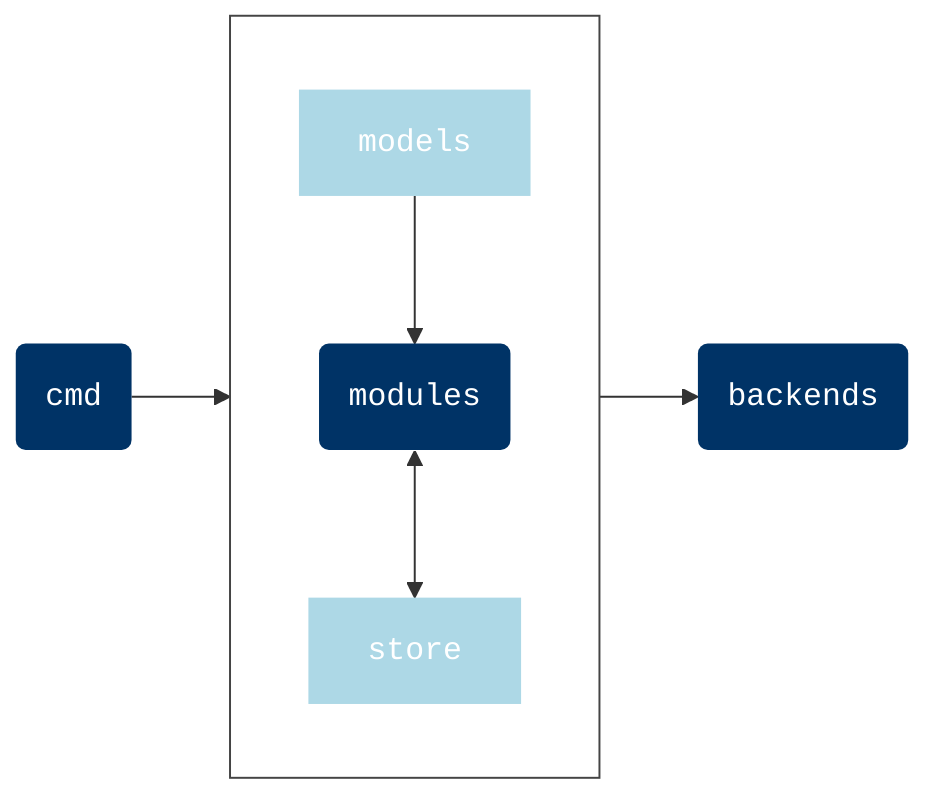

# Situation

The autonomous data collector.

Situation is a project that aims to **discover** everything on information systems, on its own. In a way, it lies between [nmap](https://nmap.org/), [telegraf](https://www.influxdata.com/time-series-platform/telegraf/) and [osquery](https://osquery.io/). However it mainly differs from them on the following aspect: **user do not declare what to collect or where**.

When we run tools like `nmap` or `telegraf`, we know the targets (ex: a subnetwork, a specific service...) and we must configure the tool in this way. `situation` aims to run without prior knowledge and this philosophy has two advantages:

- frictionless deployment (single binary, just download and run)
- no blind spots (who knows exactly what runs on his/her system?)

Situation is bound to collect data, nothing more. To go further, `situation` provides a [json schema](https://github.com/situation-sh/situation/releases/download/v0.9.0/schema.json) for the output data.


:fire: 
    Situation is a early stage project. It currently targets Linux and Windows but keep in mind that it has not been extensively tested. It does not mean that is a dangerous codebase, only that it may fail.

## Installation

### Pre-built binaries

The agent is currently available for Linux and Windows on x86_64 architectures.


```bash
wget -qO situation https://github.com/situation-sh/situation/releases/download/v0.9.0/situation-0.9.0-amd64-linux && chmod +x situation
```


```bash
curl -sLo ./situation https://github.com/situation-sh/situation/releases/download/v0.9.0/situation-0.9.0-amd64-linux && chmod +x ./situation
```


```ps1
Invoke-RestMethod -OutFile situation.exe -Uri situation https://github.com/situation-sh/situation/releases/download/v0.9.0/situation-0.9.0-amd64-windows.exe
```

### From sources

As the agent makes use of generics, you need to have the [Go compiler `>=1.18`](https://go.dev/dl/)

```shell
go install github.com/situation-sh/situation
```

:warning: 
    [Pre-built binaries](pre_built_binaries.md) are compiled with extra flags to reduce the binary size and also set the version inside the binary. See the [Makefile](https://github.com/situation-sh/situation/-/blob/main/Makefile) for more details.

:warning: 
    The `$GOPATH/bin` folder must be in your PATH to run `situation` directly from the command line

## Quick start

### Run

You guess it


```bash
situation
```


```ps1
situation.exe
```

You can get the output json schema with the `schema` subcommand.


```bash
situation schema
```


```ps1
situation.exe schema
```

Every agent as an internal UUID (`cafecafe-cafe-cafe-cafe-cafecafecafe`) by default. 
This can be printed with `id` subcommand,


```bash
situation id
```


```ps1
situation.exe id
```

and refreshed with `refresh-id` subcommand.


```bash
situation refresh-id
```

:warning: It does not work currently on windows

### One-liners

While `situation` aims to send collected data to a "remote" place for further analysis, 
its output can be quickly worked by basic cli tools like [jq](https://stedolan.github.io/jq/).

#### Network discovery


```bash
situation | jq -r '.machines[] | .nics[] | .mac + "\t" + .ip'
```


```ps1
situation.exe | jq -r '.machines[] | .nics[] | .mac + \"\t\" + .ip'
```

```console
aa:f4:b5:eb:ba:71       192.168.1.11
0e:de:c8:62:b5:1c       192.168.1.54
18:19:ba:91:b7:c7       192.168.1.13
c1:d3:d2:ab:41:cb       192.168.1.31
47:20:7b:a3:fb:2b       192.168.1.57
```

You can even put the results in a csv file:


```bash
situation | jq -r '.machines[] | .nics[] | [.mac,.ip] | @csv' > output.csv
```


```ps1
situation.exe | jq -r '.machines[] | .nics[] | [.mac,.ip] | @csv' > output.csv
```

#### Open ports


```bash
situation | jq -r '(.machines[] | .applications[] | .endpoints[] | [.addr,(.port|tostring)+"/"+.protocol])|@tsv'
```


```ps1
situation.exe | jq -r '(.machines[] | .applications[] | .endpoints[] | [.addr,(.port|tostring)+\"/\"+.protocol])|@tsv'
```

```console
192.168.1.1     53/tcp
192.168.1.1     80/tcp
192.168.1.1     1287/tcp
192.168.1.11    139/tcp
192.168.1.11    445/tcp
192.168.1.11    22/tcp
192.168.1.54    80/tcp
192.168.1.13    53/tcp
192.168.1.13    80/tcp
192.168.1.13    22/tcp
192.168.1.13    443/tcp
```

#### List services


```bash
situation | jq -r '(["Service","Address","Port"]|(., map(length*"-"))), (.machines[]|select(.hosted_agent)|.applications[]|.name as $n|.endpoints[]|[$n,.addr,(.port|tostring)+"/"+.protocol])|@tsv' | column -ts $'\t'
```


```ps1
situation.exe | jq -r '([\"Service\",\"Address\",\"Port\"]), (.machines[]|select(.hosted_agent)|.applications[]|.name as $n|.endpoints[]|[$n,.addr,(.port|tostring)+\"/\"+.protocol])|@csv' | ConvertFrom-Csv
```


```console
Service          Address        Port
-------          -------        ----
systemd-resolve  0.0.0.0        5355/tcp
systemd-resolve  ::             5355/tcp6
rpcbind          0.0.0.0        111/tcp
rpcbind          ::             111/tcp6
dnsmasq          192.168.122.1  53/tcp
rpc.statd        0.0.0.0        35645/tcp
rpc.statd        ::             50443/tcp6
systemd          ::             6556/tcp6
kdeconnectd      ::             1716/tcp6
```

## Modules

|Name|Dependencies|Architectures|Linux|Windows|System requirements|Required Go modules|
|---|---|---|---|---|---|---|
|[arp](arp.md)|[`Ping`](ping.md)|:grey_question:|:white_check_mark:|:white_check_mark:||<ul><li>[`golang.org/x/sys/windows`](https://pkg.go.dev/golang.org/x/sys/windows)</li><li>[`github.com/vishvananda/netlink`](https://pkg.go.dev/github.com/vishvananda/netlink/)</li></ul>|
|[docker](docker.md)|[`Host network`](host_network.md) [`TCP Scan`](tcp_scan.md)|:grey_question:|:white_check_mark:|:children_crossing:|Must belong to `docker` group (Linux + unix socket)|<ul><li>[`github.com/docker/docker/client`](https://pkg.go.dev/github.com/docker/docker/client)</li><li> [`github.com/docker/docker/api/types`](https://pkg.go.dev/github.com/docker/docker/api/types)</li><li>[`github.com/docker/docker/api/types/filters`](https://pkg.go.dev/github.com/docker/docker/api/types/filters)</li><li>[`github.com/docker/docker/api/types/network`](https://pkg.go.dev/github.com/docker/docker/api/types/network)</li></ul>|
|[host-basic](host_basic.md)||:grey_question:|:white_check_mark:|:white_check_mark:||<ul><li>[`github.com/shirou/gopsutil/v3/host`](https://pkg.go.dev/github.com/shirou/gopsutil/v3/host)</li></ul>|
|[host-cpu](host_cpu.md)|[`Host basic`](host_basic.md)|:grey_question:|:white_check_mark:|:white_check_mark:||<ul><li>[`github.com/shirou/gopsutil/v3/cpu`](https://pkg.go.dev/github.com/shirou/gopsutil/v3/cpu)</li></ul>|
|[host-network](host_network.md)|[`Host basic`](host_basic.md)|:grey_question:|:white_check_mark:|:white_check_mark:|||
|[netstat](netstat.md)|[`Host basic`](host_basic.md)|:grey_question:|:white_check_mark:|:white_check_mark:|Need root privileges|<ul><li>[`github.com/cakturk/gonetstat/netstat`](https://pkg.go.dev/github.com/cakturk/gonetstat/netstat)</li></ul>|
|[ping](ping.md)|[`Host network`](host_network.md)|:grey_question:|:white_check_mark:|:white_check_mark:||<ul><li>[`github.com/goping/ping`](https://pkg.go.dev/github.com/goping/ping)</li></ul>|
|[tcp-scan](tcp_scan.md)|[`ARP`](arp.md)|:grey_question:|:white_check_mark:|:white_check_mark:|||

### ARP


|             ID Card |                                                                                                                                                                                                                    |
| ------------------: | :----------------------------------------------------------------------------------------------------------------------------------------------------------------------------------------------------------------- |
|        Dependencies | [`Ping`](ping.md)                                                                                                                                                                                                  |
|       Architectures | :grey_question:                                                                                                                                                                                                       |
|               Linux | :white_check_mark:                                                                                                                                                                                                 |
|             Windows | :white_check_mark:                                                                                                                                                                                                 |
| System requirements |                                                                                                                                                                                                                    |
| Required Go modules | <ul><li>[`golang.org/x/sys/windows`](https://pkg.go.dev/golang.org/x/sys/windows)</li><li>[`github.com/vishvananda/netlink`](https://pkg.go.dev/github.com/vishvananda/netlink/)</li></ul> |

### Docker

|             ID Card |                                                                                                                                                                                                                                                                                                                                                                                                                                                                                                              |
| ------------------: | :----------------------------------------------------------------------------------------------------------------------------------------------------------------------------------------------------------------------------------------------------------------------------------------------------------------------------------------------------------------------------------------------------------------------------------------------------------------------------------------------------------- |
|        Dependencies | [`Host network`](host_network.md) [`TCP Scan`](tcp_scan.md)                                                                                                                                                                                                                                                                                                                                                                                                                                                  |
|       Architectures | :grey_question:                                                                                                                                                                                                                                                                                                                                                                                                                                                                                                 |
|               Linux | :white_check_mark:                                                                                                                                                                                                                                                                                                                                                                                                                                                                             |
|             Windows | :children_crossing:                                                                                                                                                                                                                                                                                                                                                                                                                                                                            |
| System requirements | Must belong to `docker` group (Linux + unix socket)                                                                                                                                                                                                                                                                                                                                                                                                                                                          |
| Required Go modules | <ul><li>[`github.com/docker/docker/client`](https://pkg.go.dev/github.com/docker/docker/client)</li><li> [`github.com/docker/docker/api/types`](https://pkg.go.dev/github.com/docker/docker/api/types)</li><li>[`github.com/docker/docker/api/types/filters`](https://pkg.go.dev/github.com/docker/docker/api/types/filters)</li><li>[`github.com/docker/docker/api/types/network`](https://pkg.go.dev/github.com/docker/docker/api/types/network)</li></ul> |

### Host basic

|             ID Card |                                                                                                                             |
| ------------------: | :-------------------------------------------------------------------------------------------------------------------------- |
|        Dependencies |                                                                                                                             |
|       Architectures | :grey_question:                                                                                                                |
|               Linux | :white_check_mark:                                                                                            |
|             Windows | :white_check_mark:                                                                                            |
| System requirements |                                                                                                                             |
| Required Go modules | <ul><li>[`github.com/shirou/gopsutil/v3/host`](https://pkg.go.dev/github.com/shirou/gopsutil/v3/host)</li></ul> |

### Host CPU


|             ID Card |                                                                                                                           |
| ------------------: | :------------------------------------------------------------------------------------------------------------------------ |
|        Dependencies | [`Host basic`](host_basic.md)                                                                                             |
|       Architectures | :grey_question:                                                                                                              |
|               Linux | :white_check_mark:                                                                                          |
|             Windows | :white_check_mark:                                                                                          |
| System requirements |                                                                                                                           |
| Required Go modules | <ul><li>[`github.com/shirou/gopsutil/v3/cpu`](https://pkg.go.dev/github.com/shirou/gopsutil/v3/cpu)</li></ul> |

### Host network

|             ID Card |                                  |
| ------------------: | :------------------------------- |
|        Dependencies | [`Host basic`](host_basic.md)    |
|       Architectures | :grey_question:                     |
|               Linux | :white_check_mark: |
|             Windows | :white_check_mark: |
| System requirements |                                  |
| Required Go modules |                                  |

### Netstat 

|             ID Card |                                                                                                                                   |
| ------------------: | :-------------------------------------------------------------------------------------------------------------------------------- |
|        Dependencies | [`Host basic`](host_basic.md)                                                                                                     |
|       Architectures | :grey_question:                                                                                                                      |
|               Linux | :white_check_mark:                                                                                                                |
|             Windows | :white_check_mark:                                                                                                                |
| System requirements | Need root privileges                                                                                                              |
| Required Go modules | <ul><li>[`github.com/cakturk/go-netstat/netstat`](https://pkg.go.dev/github.com/cakturk/go-netstat/netstat)</li></ul> |

### Ping

|             ID Card |                                                                                                       |
| ------------------: | :---------------------------------------------------------------------------------------------------- |
|        Dependencies | [`Host network`](host_network.md)                                                                     |
|       Architectures | :grey_question:                                                                                          |
|               Linux | :white_check_mark:                                                                      |
|             Windows | :white_check_mark:                                                                      |
| System requirements |                                                                                                       |
| Required Go modules | <ul><li>[`github.com/go-ping/ping`](https://pkg.go.dev/github.com/go-ping/ping)</li></ul> |

### TCP Scan


|             ID Card |                                  |
| ------------------: | :------------------------------- |
|        Dependencies | [`ARP`](arp.md)                  |
|       Architectures | :grey_question:                     |
|               Linux | :white_check_mark: |
|             Windows | :white_check_mark: |
| System requirements |                                  |
| Required Go modules |                                  |

## Backends

### Stdout (default)

The default behavior of Situation is to print the final payload to stdout.


```bash
situation --backends.stdout.enabled=false
```


```yaml
backends:
    stdout:
        enabled: false
```


:warning: 
    Due to a bug in a third party library, the `enabled` attribute cannot be changed in the configuration file (see [this issue](https://github.com/urfave/cli/issues/1395))

### File

The payload can also be stored in a file.


```bash
situation --backends.file.enabled=true --backends.file.format=json --backends.file.path=/tmp/situation.json
```


```yaml
backends:
    file:
        enabled: true
        format: json
        path: /tmp/situation.json
```

### HTTP

Finally, the http backend is very convenient to send the payload (json) directly to a remote server.


```bash
situation --backends.http.enabled=true --backends.http.url=http://localhost:8000/situation/ --backends.http.method=POST --backends.http.header.content-type=application/json --backends.http.header.authorization="Bearer <APIKEY>" 
```


```yaml
backends:
    http:
        enabled: true
        url: http://localhost:8000/situation/
        method: POST
        header:
            content-type: application/json
            authorization: "Bearer <APIKEY>" 
```

## Developers

The Situation project aims to be enriched by the community, and [modules](../modules) are definitely a good starting point for developers to contribute.

Before detailing the internals of Situation, it is paramount to understand the overall spirit of the project.

**No user interaction**: it means that the agent must run without configuration, without integration, without dependency. In some cases, we obvioulsy need some extra information. In this project, the developer should code enough logic to guess what is missing. For instance, if you want to detect a database, you need to guess what could be its listening port.

Fortunately, modules also provide data that could be useful for the next ones through the [store](store.md). So developers should well define their dependencies to ease the workflow their module. Basically, we should avoid to do twice the same thing.

**Security**: yes it is hard to ensure at 100%. However, for this kind of project, we quickly feel like using `exec.Command` and other shortcuts that ease developers' job (but decrease security level). So, do not use `exec.Command` and do not use library that uses it. In nutshell, we should keep in mind that this agent is likely to run with root privileges on critical systems.

### Architecture

The agent is divided into several modules.

| Module     | Job                                                             |
| ---------- | --------------------------------------------------------------- |
| `backends` | all the possible outputs (like stdout, file, databases...)      |
| `cmd`      | agent entrypoint (it basically manage the run of the agent)     |
| `models`   | store the models that represent what could be discovered        |
| `modules`  | gather the _independent_ module that will be run during scan    |
| `store`    | internal payload where all the retrieved information are stored |
| `utils`    | extra helpers                                                   |

The overall architecture is quite classical for plugin-based tools. An orchestrator schedules and runs the available modules and all the collected data can be sent in the backend you want.



### Modules 

#### Introduction

A module is an _independent_ piece of code that can be run during scan. Its job is merely to enrich the store.
It is not fully independent as it may depend on previous modules (some module are likely to need data provided by others).

To develop a module, just init a new `my_new_module.go` source file in the `modules/` subdirectory. The structure of the module should look like the following snippet.

```go
package modules

import (
    // ...
)

func init() {
    m := &MyNewModule{}
    RegisterModule(m)
    // SetDefault
    SetDefault(m, "myparam", value, "the value of myparam")
    // ...
}

type MyNewModule struct {}

// Name returns the name of the module
func (m * MyNewModule) Name() string {
    // return the name of the module with a dash
    return "my-new-module"
}

// Dependencies return the list of modules
// required to run this one
func (m * MyNewModule) Dependencies() []string {
    // put the name of the modules you depend on here
    return []string{"host-basic"}
}

// Run do the job. It returns error only if it really
// fails, i.e. it cannot be run (like privileges).
// In the other cases, just log the errors
func (m * MyNewModule) Run() error {
    // you can grab your logger (from https://github.com/Sirupsen/logrus)
    logger := GetLogger(m)
    // you can grab config with GetConfig.
    // :warning: generics are used to access the config
    // GetConfig[<TYPE>](>MODULE>, <KEY>)
    myParam := GetConfig[time.Duration](m, "myparam")
    // ...
    // do what you want
    // ...
    // but do not return error except if something
    // prevents the module to be run, just log them:
    // logger.Error(err)
    // ...
    //
    // don't forget to put data into the store
    // ...
    return nil
}


```

#### Naming

You are free about the module naming, but obviously there are some constraints:

- the module name must be unique
- the name should describe what the module does (or the ecosystem, like "docker")
- If you wan to create a module called "awesome stuff":
  - its name (output of `.Name()`) must be `awesome-stuff`
  - the object that respects the `Module` interface must be `AwesomeStuffModule`
  - the source file must be `awesome_stuff.go`

#### Module interface

A module must implement the `Module` interface described below.

```go
// Module is the generic module interface to implement plugins to
// the agent
type Module interface {
	Name() string
	Dependencies() []string
	Run() error
}
```

The `Name()` outputs the [unique] name of the module.

The `Dependencies()` returns the name of the modules required to start this module (prior information).

The `Run()` function does the job. This functions is called during the scan. It may have several interactions:

- [config](#configuration) (get extra configuration data)
- [logging](#logging) (output some information about the run)
- [store](#the-store) (retrieve/store collected data)

#### Configuration

The configuration is only managed by the flags of [urfave/cli](https://github.com/urfave/cli).

The configuration of the modules are stored in the `modules.module-name.*` namespace. To hide it to the developper, the `modules` package expose two helpers:

```go
// GetConfig is a generic function that returns a value
// associated to a key within the module namespace
func GetConfig[T any](m Module, key string) (T, error) {
	// ...
}

// SetDefault is a helper that defines default module parameter.
// The provided values can be overwritten by CLI flags or config file.
func SetDefault(m Module, key string, value interface{}, usage string) {
    // ...
}
```


#### Logging

The logging is managed by [logrus](https://github.com/Sirupsen/logrus). To log some information, the `modules` package expose a `GetLogger` function that returns a contextual logger (relative to the module).

```go
func (m * MyModule) Run() error {
    // ...
    logger := GetLogger(m)
    // now you can use the classical methods
    logger.Debug("Debug message")
    logger.Info("Info message")
    logger.Warn("Warning message")
    logger.Error("Error message")
    logger.Fatal("Fatal error")
    // you should avoid logger.Panic to prevent the agent from crashing

    // ...
}
```

In addition, the module is likely to collect some information. You can log the collected data in a structured manner with the `logger.WithField` method.

```go
func (m * MyModule) Run() error {
    // ...
    logger := GetLogger(m)
    // ...
    // append the fields you want to show and call Debug/Info method
    logger.WithField("hostname", hostname).Debug("Hostname found!")
}
```

#### Big module case

if your module is heavy you can store all the work (namely the material for the `Run` function) inside a submodule and write a short interface in the `modules` directory.

You may have the following layout:

```bash
modules/
    heavy.go
    heavy/
        file1.go
        file2.go
        ...
```

The `heavy.go` file may look like the following:

```go

import (
    // ...

	// load the submodule
	 "github.com/situation-sh/situation/modules/heavy"

)

type HeavyModule struct {}

func init() {
    RegisterModule(&HeavyModule{})
}

func (m * HeavyModule) Name() string {
    // return the name of the module with a dash
    return "heavy"
}

func (m * HeavyModule) Dependencies() []string {
    // put the name of the modules you depend on here
    return []string{}
}

func (m * HeavyModule) Run() error {
    // ...
    // call heavy.Stuff
    // ...
}
```

### Store 

The **Store** is the internal memory where the agent put collected data. It has an internal structure with some helpers we advise to use. The store is closely related to the models defined in the `models` module. The store can be filled and queried as well (we try to make it **thread-safe**).

Basically, the store is a list of machines (`models.Machine`), so you may look for machines (to get information or to enrich it) or merely insert new ones.

:warning: 
    The store and the models are rather instable. Especially, developers are likely to update the models (add/modify/remove attribute). Even if some functions help hiding the details, some changes can obviously have a wide impact.

### Contributing

When contributing to this project, please first discuss the change you wish to make via Github **issue**. 
The issue should be enough documented to well understand the bug or the requested feature.  

#### License 

All the code submitted in this project follows the [project LICENSE](https://{{ go_module }}/blob/main/LICENSE.md).

#### MR Process

1. Fork the project into your personal namespace (or group) on Github.
2. Create a feature branch in your fork with naming `<issue-id>-<lowercase-title-of-the-issue>`.
3. Make changes (code, docs...)
4. Ensure the documentation is updated (`docs/` folder)
5. Push the commits to your feature branch in your fork.
6. Submit a pull request (PR) to the main branch in the main Github project.


#### Coding Style

*Taken from [moby/moby](https://github.com/moby/moby/blob/master/CONTRIBUTING.md#coding-style)*

Unless explicitly stated, we follow all coding guidelines from the Go
community. While some of these standards may seem arbitrary, they somehow seem to result in a solid, consistent codebase.

It is possible that the code base does not currently comply with these
guidelines. We are not looking for a massive PR that fixes this, since that
goes against the spirit of the guidelines. All new contributions should make a best effort to clean up and make the code base better than they left it.
Obviously, apply your best judgement. Remember, the goal here is to make the
code base easier for humans to navigate and understand. Always keep that in
mind when nudging others to comply.

The rules:

1. All code should be formatted with `gofmt -s`.
2. All code should pass the default levels of
   [`golint`](https://github.com/golang/lint).
3. All code should follow the guidelines covered in [Effective
   Go](http://golang.org/doc/effective_go.html) and [Go Code Review
   Comments](https://github.com/golang/go/wiki/CodeReviewComments).
4. Comment the code. Tell us the why, the history and the context.
5. Document _all_ declarations and methods, even private ones. Declare
   expectations, caveats and anything else that may be important. If a type
   gets exported, having the comments already there will ensure it's ready.
6. Variable name length should be proportional to its context and no longer.
   `noCommaALongVariableNameLikeThisIsNotMoreClearWhenASimpleCommentWouldDo`.
   In practice, short methods will have short variable names and globals will
   have longer names.
7. No underscores in package names. If you need a compound name, step back,
   and re-examine why you need a compound name. If you still think you need a
   compound name, lose the underscore.
8. [WIP] No utils or helpers packages. If a function is not general enough to
   warrant its own package, it has not been written generally enough to be a
   part of a util package. Just leave it unexported and well-documented.
9. All tests should run with `go test` and outside tooling should not be
   required. No, we don't need another unit testing framework. Assertion
   packages are acceptable if they provide _real_ incremental value.
10. Even though we call these "rules" above, they are actually just
    guidelines. Since you've read all the rules, you now know that.

If you are having trouble getting into the mood of idiomatic Go, we recommend
reading through [Effective Go](https://golang.org/doc/effective_go.html). The
[Go Blog](https://blog.golang.org) is also a great resource. Drinking the
kool-aid is a lot easier than going thirsty.

## Roadmap

More modules :grin:

