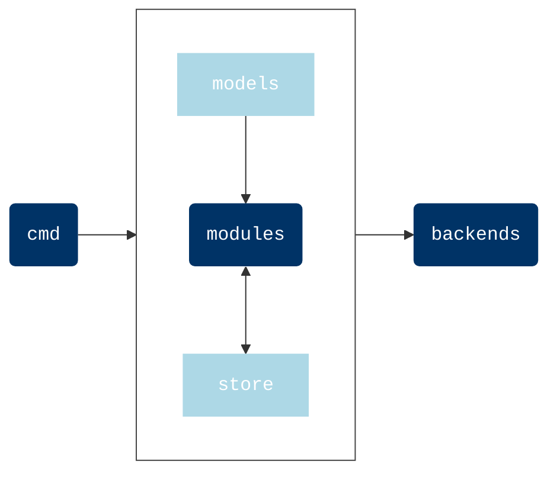

# Architecture

The agent is divided into several modules.

| Module     | Job                                                             |
| ---------- | --------------------------------------------------------------- |
| `backends` | all the possible outputs (like stdout, file, databases...)      |
| `cmd`      | agent entrypoint (it basically manage the run of the agent)     |
| `models`   | store the models that represent what could be discovered        |
| `modules`  | gather the _independent_ module that will be run during scan    |
| `store`    | internal payload where all the retrieved information are stored |
| `utils`    | extra helpers                                                   |

The overall architecture is quite classical for plugin-based tools. An orchestrator schedules and runs the available modules and all the collected data can be sent in the backend you want.

